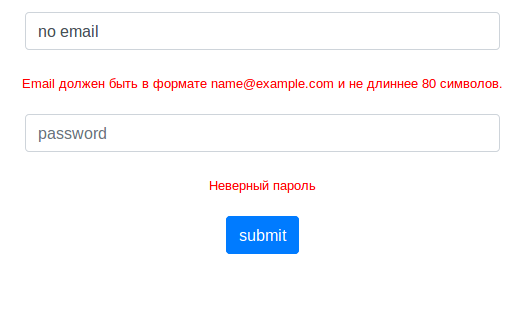

## Основные моменты
1. Регистрация производится через следующий алгоритм:   
Генерируется соль,  32 символа из диапазона [a-zA-Z0-9], соединятся с валидным паролем пользователя и все это хэшируется через md5(), в базу дынных добавляется хеш и соль.
2. Вывод ошибок сделан с помощью AJAX, что позволяет не перезагружать каждый раз страницу.
3. Защита XSRF, XS уязвимостей.
## Используемые технологии
+ ООП
+ Depency Injection
+ MVC
+ паттерн TableDataGateway
+ Twig
+ Twitter Bootstrap
+ Защита от XSRF,XSS уязвимостей
+ PDO
+ Composer Autoload
+ AJAX
+ Jquey
+ JSON
+ Git
## Структура
Регистрация  
Авторизация  
Личный кабинет с возможностью изменить никнейм и выйти из учетной записи. Доступен только для зарегистрированных пользователей
## Установка
## Установка
+ создать таблицу на основе дампа в `database.sql`
+ создать `config.json` на примере `config.example.json`, указать путь к проекту и настройки базы данных
+ Установить  Апач и скопировать настройки в файле `httpd.conf`
+ Установить [Сomposer](https://getcomposer.org/)
## Требования
+ PHP >= 7.2 
+ MySQL 5.7.21
+ Apache/2.4.18 
## Скриншоты программы
### Авторизация

### Регистрация

### Личный кабинет
